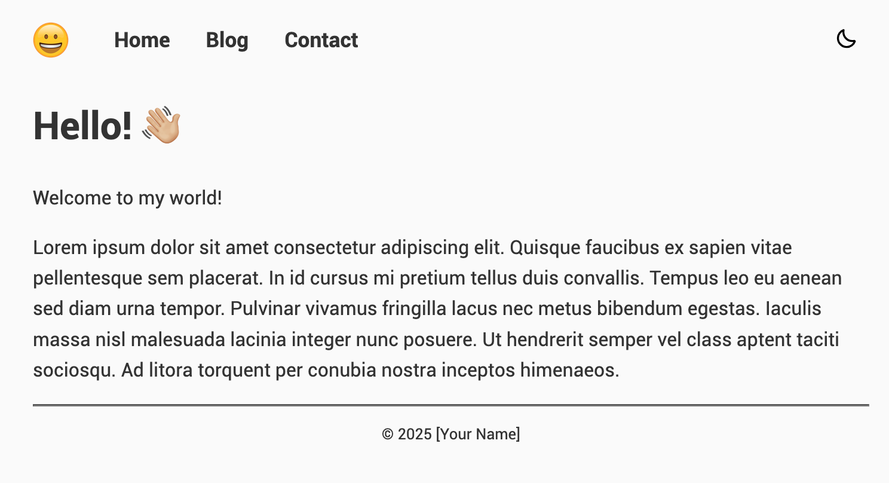
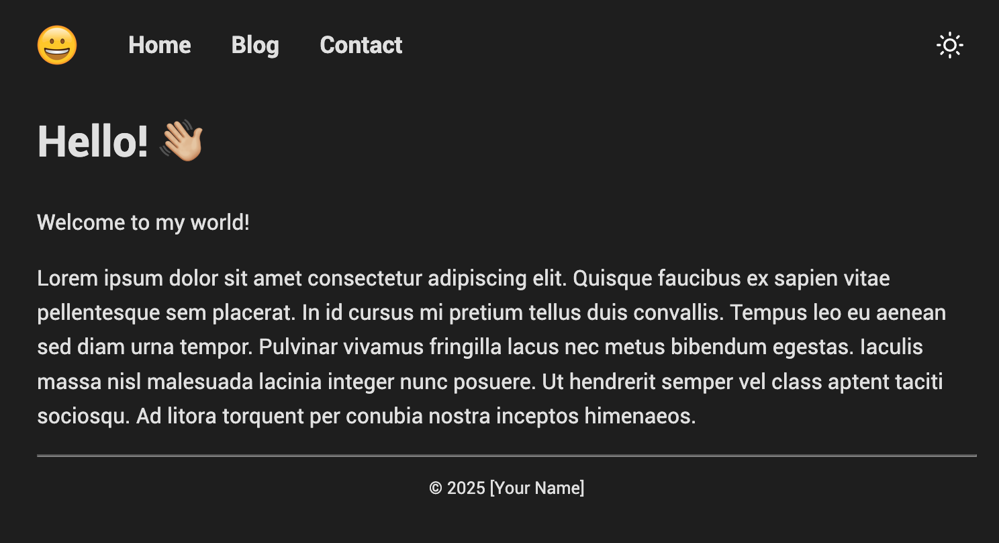

# clean-vibe-theme

This is a simple Jekyll theme with a blog and a light/dark theme toggle.




I have used ChatGPT and Github Co-pilot a lot when creating this theme. I had limited knowledge about Jeykll.

## Getting Started

1. Install Ruby. (See instructions for your operating system.)
2. Install Bundler and Jekyll.
```
$ gem install bundler jekyll
```
3. Set up your Jekyll website.
```
$ bundle install
$ bundle exec jekyll serve
```
4. Open `http://localhost:4000/` from your browser.